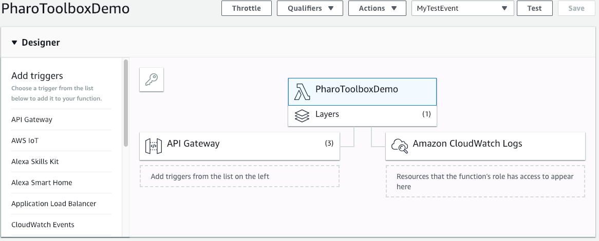

## Pharo Lambda Demo

The demo functions are implemented by the class **AWSLambdaAPIGatewayDemoHandler**. 
Currently three functions are implemented that simply return some information about the Smalltalk
image. 

#### Function 1: Return some info about a specific class
```smalltalk
showClassInfo: apiRequest

	| class |
	
	class := self getClassnameFrom: apiRequest
			ifAbsent: [ ^ self handleNotFound: 'Class not found' ].

	"Force an error so we can test the error handling"
	class name = #Error
		ifTrue: [ nil doYouUnderstandThisMessage ].
			
	^ SmallDictionary new
			at: #name put: class name;
			at: #superclass put: class superclass name;
			yourself
```

The dictionary returned will be converted into JSON. To test the error handling of the Pharo Lambda Runtime
you can ask for info about the Error class. This will trigger a MessageNotUnderstood error.

#### Function 2: Return a list of methods for a specific class
```smalltalk
showMethodNames: apiRequest

	| class meta |
	
	class := self getClassnameFrom: apiRequest
			ifAbsent: [ ^ self handleNotFound: 'Class not found' ].
			
	meta := (apiRequest queryStringParameterAt: 'meta' ifAbsent: [ 'false' ]) = 'true'.
	^ meta 
		ifTrue: [ class class methodDict keys sorted ]
		ifFalse: [ class methodDict keys sorted ]
```

#### Function 3: An about function which provides info about the runtime environment
```smalltalk
showAbout: apiRequest
			
	^ SmallDictionary new
			at: #description put: 'About ', self class name;
			at: #image put: SystemVersion current imageVersionString;
			at: #systemInfo put: self systemInfoDictionary;
			yourself
```

### AWS Lambda demo setup

#### Step 1: Prepare a Smalltalk image
Load the AWS-Lamba-Runtime package which includes the demo code. Prepare the image for the Lambda runtime
environment by [disabling](pharo-lambda-runtime.md#preparing-a-smalltalk-image-for-deployment) any functionality that tries to create or write to existing files.

#### Step 2: Create a zip file with the Smalltalk image and a bootstrap file
Create a file called bootstrap which starts you image, for example:
```
#!/bin/sh
pharo --nodisplay aws-toolbox-pharo70.image --no-default-preferences aws-lambda
```
Create a zip file with the your image, the bootstrap file and any other file that your code needs.

#### Step 4: Define the Lambda function using the AWS Console

Use the Create function / Author from scratch operation in the AWS Console.
- Select "Use custom runtime in function code or layer" as the Runtime
- Add the API Gateway as the trigger for your function
- Add the Smalltalk VM layer. The layer version ARN for this layer is arn:aws:lambda:eu-west-1:544477632270:layer:Pharo61-runtime:3
- Upload your zip file as the Function package and set the Handler to AWSLambdaAPIGatewayDemoHandler



#### Step 5: Test your Lambda function

Using the Test button you can execute your function. A valid event you can use for this:
```json
{
  "resource": "/classes/{className}/methods",
  "httpMethod": "GET",
  "pathParameters": {
    "className": "Array"
  },
  "body": null,
  "isBase64Encoded": false
}
```

Your function now works. The next step is to make it available to the outside world via the AWS API Gateway.

#### Step 6: Create a new API using the AWS API Gateway

- In the AWS Console goto the API Gateway service and choose Create API. You can use [this](pharo-lambda-demo/pharo-lambda-demo-api.json) OpenAPI json file that defines
the three demo functions as http get api calls.
- Configure your API to use "Lambda proxy Integration" and link all three API calls to the same Lambda function.
- Create a "Stage" to publich you API.

Your Lambda function should now be callable from the outside world. The url's will look something like this:

```
https://xxxxxxx.execute-api.eu-west-1.amazonaws.com/test/classes/Array/methods
``` 


